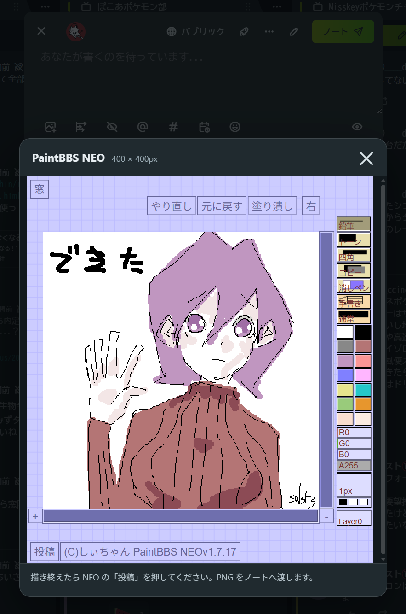
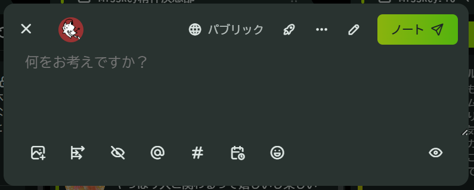
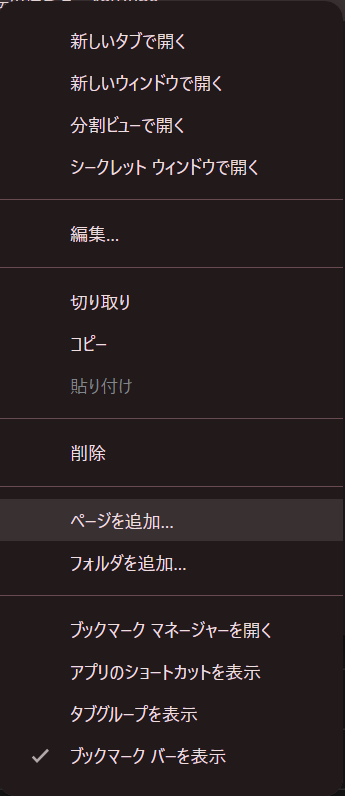
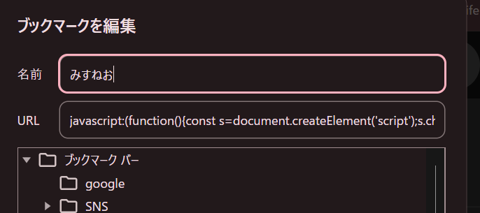

# missneo

みすねお

## 何



misskeyにPaintBBS NEOでお絵描きするブックマークレットです。
Codex使用

PaintBBS NEO: [funige/neo](https://github.com/funige/neo/tree/master)

## 使い方



misskeyのノートする画面を呼び出し、以下のブックマークレットを起動します。

```javascript
javascript:(function(){const s=document.createElement('script');s.charset='UTF-8';s.src='https://neo.sakots.net/missneo.js?'+Date.now();document.head.appendChild(s);})();
```

1. Misskeyでノート作成画面を開きます。
2. ブックマークレットを起動すると、400×400pxのPaintBBS NEOが開きます。
3. サイズを変える場合は、画面上部の「横」「縦」へ入力して「変更」を押します。描画中のサイズ変更では、現在の描画内容が消去されます。
4. PaintBBS NEOで絵を描いて「投稿」を押します。
5. 対応するMisskeyでは画像がノートへ貼り付けられます。自動で貼り付けられなかった場合は、フォーカスされたノート欄で `Ctrl+V`（Macは `⌘V`）を押してください。

画像のクリップボード書き込みには、HTTPSで配信されたMisskeyと、画像のClipboard APIに対応したブラウザが必要です。(google chromeとmicrosoft edgeは対応しています。)
通常のノート作成画面に加えて、チャンネルの固定投稿欄とチャンネル投稿ダイアログにも対応しています。

## ブックマークレットの使い方

### google chromeの場合

ブックマークメニューの「ページを追加」を選びます。



続いてわかりやすい名前と上記使い方のjavascriptを貼り付けて決定してください。



### microsoft edgeの場合

edgeはメニューからのブックマークレット新規作成ができません。
既存のブックマークをコピーし、編集してURLを上記javascriptに変更してください。
その後、ブックマークレットの名前はいいかんじに設定してください。

## 開発用

Typescriptとpnpmを使用します。
gitでリポジトリをクローンして開発します。

```bash
pnpm install
pnpm run build
```

ソースは `src/missneo.ts`、配信用ファイルは `missneo.js` です。
画面下部へ表示するバージョン番号には `package.json` の `version` が使用され、ビルド時に自動で挿入されます。

## 更新履歴

### [2026/07/30] v0.0.2

- Misskeyのチャンネル投稿画面に対応

### [2026/07/30] v0.0.1

- PaintBBS NEOのお絵描き画面と、PNGのクリップボード貼り付け機能を追加
- 描画画面上部からのサイズ変更に対応（デフォルト400×400px）
- 描画画面下部にmissneoのバージョン番号を表示
- NEOの「窓」表示中に投稿した場合の自動貼り付けを修正
- NEOの「窓」表示をモーダル全体へ反映
- リポジトリ生やした
